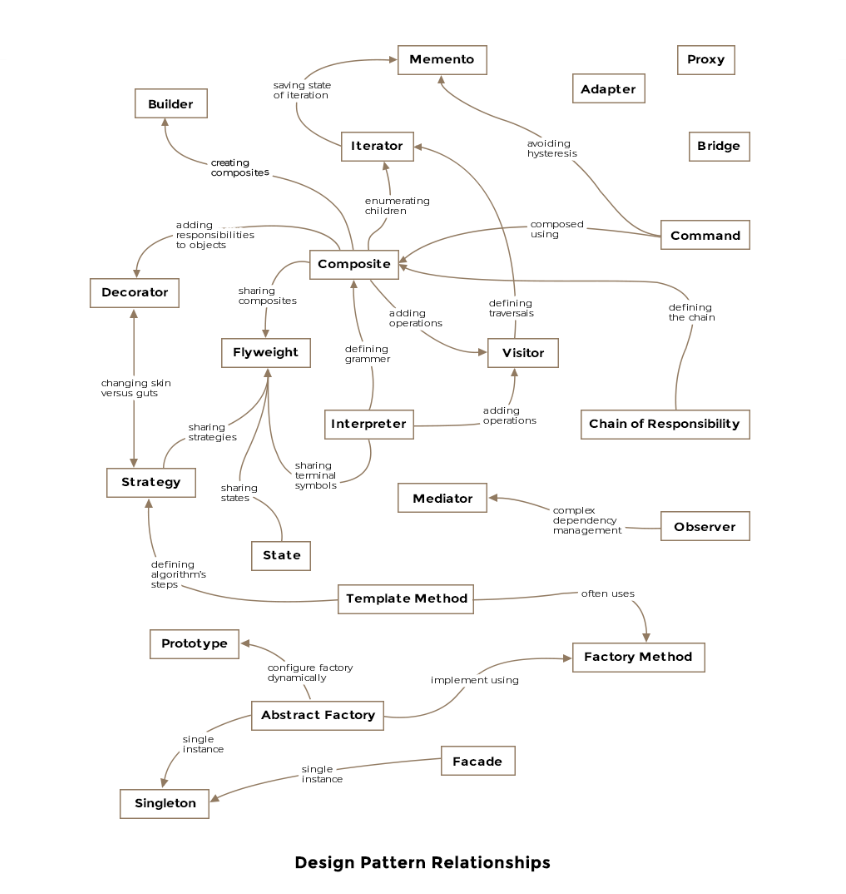

# software-design-patterns


## 序言
为什么我们需要模式？
直截了当的答案是我们不想重新发明轮子！在技术生活中经常发生的问题通常具有定义明确的解决方案，这些解决方案灵活，模块化且更易于理解。这些从战术细节上抽象出来的解决方案成为设计模式。如果您在设计一个与上一个问题的解决方案极为相似的问题的解决方案时遇到了似曾相识的感觉，尽管在不同的领域，那么您可能在不知不觉中使用了一种模式。

一个示例，以了解什么是设计模式以及如何应用它们。
类构造函数是面向对象语言中的基本概念之一。构造函数帮助创建类的对象，并可以接受参数。让我们以以下课程为例。

 ```cpp
public class Aircraft {
 
    private String type;
 
    public Aircraft(String type) {
        this.type = type;
    }
}
```
在上面的示例中，我们为该类提供了默认构造函数，该构造函数接受type飞机的单个参数the 。现在说几天后，您意识到您想向Aircraft班级添加其他属性。假设您要添加飞机的颜色作为属性，但是您已经发布了一个版本的库，并且无法修改原始构造函数。解决方案是添加另一个具有两个参数的构造函数，如下所示
```cpp
public class Aircraft {
 
    private String type;
    private String color;
 
    public Aircraft(String type) {
        this.type = type;
    }
 
    public Aircraft(String type, String color) {
        this.type = type;
        this.color = color;
    }
}
```
如果继续这种方式，您将最终得到一堆构造函数，其中的参数越来越像望远镜：

``` cpp
Aircraft(String type)
Aircraft(String type, String color)
Aircraft(String type, String color, String prop3)
Aircraft(String type, String color, String prop3, String prop4)  
```  
The telescoping pattern is called an anti-pattern: how NOT to do things! 处理变量越来越多的类的方法是使用构建器模式(Builder Pattern)，我们将在接下来的章节中深入讨论。

经验丰富的开发人员应精通设计模式，应用这些模式可使代码在将来可重用和可维护。设计模式不仅限于面向对象的语言，还存在于计算机科学的其他领域，例如分布式系统，大数据系统或用户界面。


急于要接受即将面试的课程的人们，我建议您遍历所有的创建型模式，装饰器，代理，迭代器，观察者和访客模式。

创建型模式：新创建的对象听起来可能很琐碎，但在创建对象实例时随便乱扔代码会导致日后的头痛。创新的设计模式提供了有关如何最好地将对象创建过程封装到程序中的有力建议。

结构型模式与类的组成有关，即类的构成或构造方式

行为设计模式规定了类和对象之间的交互以及责任的委派。


对于大多数模式，我们借鉴航空业的概念来创建示例。您会发现定期谈论波音飞机，以详细说明讨论中的模式。

## 目录
[建造者模式（Builder-Pattern）](./建造者模式（Builder-Pattern）.md)


## 参考资料
