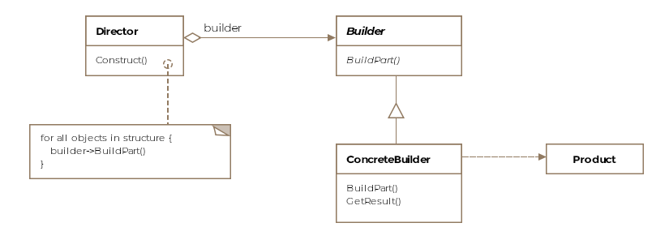

建造者模式是什么 ？
顾名思义，建造者模式用于构建对象。有时，我们创建的对象可能很复杂，可能由多个子对象组成，或者需要复杂的构建过程。通过使用建造者模式，可以简化创建复杂类型的过程。A composite or an aggregate object is what a builder generally builds.

Formally, a builder pattern encapsulates or hides the process of building a complex object and separates the representation of the object and its construction. The separation allows us to construct different representations using the same construction process. 
严谨地说，**构建器模式封装或隐藏了构建复杂对象的过程，并分离了对象的表示形式及其构造**。这种分离使我们可以**使用相同的构建过程来构建不同的表示形式**。用Java来说，不同的表示方式意味着创建可以共享相同构造过程的不同类的对象。

类图
类图由以下实体组成

- Builder
- Concrete Builder
- Director
- Product



接下来的示例讨论了如何在不将表示和构造复杂的对象两个操作耦合在一起。
示例：
以制造飞机为例，假设飞机的制造过程分三个步骤进行：
- 驾驶舱的制作
- 引擎
- 翅膀

在我们的假设世界中，每架飞机至少需要上述三个步骤。但是，客机可以增加在飞机上建造浴室的步骤。这些步骤从我们的正式定义中代表了构建过程。该产品是飞机，但可以有不同的表示形式，例如F-16或波音747。使用相同的建造过程，我们应该能够同时生产F-16和波音。

现在看一些代码。首先，我们将从`AircraftBuilder类`的抽象接口开始。
- The builder contains a method for each component that can be part of the final product. These methods are selectively overridden by concrete builders depending on if the builders will be including that part in the final product variant that they are responsible for building.
```java
public abstract class AircraftBuilder {
 
    public void buildEngine() {
 
    }
 
    public void buildWings() {
 
    }
 
    public void buildCockpit() {
 
    }
 
    public void buildBathrooms() {
 
    }
 
    abstract public IAircraft getResult();
}
```

现在，我们将实施两个具体的建造者，一个用于F-16，另一个用于波音747。
```java
public class Boeing747Builder extends AircraftBuilder {
 
    Boeing747 boeing747;
 
    @Override
    public void buildCockpit() {
 
    }
 
    @Override
    public void buildEngine() {
 
    }
 
    @Override
    public void buildBathrooms() {
        
    }
 
    @Override
    public void buildWings() {
 
    }
 
    public IAircraft getResult() {
        return boeing747;
    }
}
 
public class F16Builder extends AircraftBuilder {
 
    F16 f16;
 
    @Override
    public void buildEngine() {
        // get F-16 an engine
        // f16.engine = new F16Engine();
    }
 
    @Override
    public void buildWings() {
        // get F-16 wings
        // f16.wings = new F16Wings();
    }
 
    @Override
    public void buildCockpit() {
        f16 = new F16();
        // get F-16 a cockpit
        // f16.cockpit = new F16Cockpit();
    }
 
    public IAircraft getResult() {
        return f16;
    }
}
```
为简便起见，我们提供了构建器的框架，并跳过了每种方法的单独实现。请注意，F16Builder它不会覆盖该buildBathrooms方法，因为F-16座舱中没有浴室。由于波音747拥有供乘客使用的浴室，因此波音的制造商确实重写了浴室的方法。

建造飞机所需的过程或算法（在我们的案例中是创建不同零件的特定顺序）被称为的另一个`类Director`捕获。`Director类`在某种意义上指导着飞机的建造。最终产品仍由建造者（builders）返回（return）。
```java
public class Director {
 
    AircraftBuilder aircraftBuilder;
 
    public Director(AircraftBuilder aircraftBuilder) {
        this.aircraftBuilder = aircraftBuilder;
    }
 
    public void construct(boolean isPassenger) {
        aircraftBuilder.buildCockpit();
        aircraftBuilder.buildEngine();
        aircraftBuilder.buildWings();
 
        if (isPassenger)
            aircraftBuilder.buildBathrooms();
    }
}
```
请注意，我们如何通过我们选择的制造商，并将飞机产品（表示形式）更改为F-16或Boeing-747。在我们的方案中，建造者返回相同的超类型，但是如果构建器返回的产品不太相似，则情况可能并非如此。

客户端将使用以下模式：
```java
public class Client {
 
    public void main() {
 
        F16Builder f16Builder = new F16Builder();
        Director director = new Director(f16Builder);
        director.construct(false);
 
        IAircraft f16 = f16Builder.getResult();
    }
}
```
The AircraftBuilder interface hides how a given aircraft gets built. The client is unaware of the classes F16Engine, F16Cockpit and similar classes for Boeing-747.

Skipping the Director：
您可能会发现在没有Director的情况下使用了构建器模式。客户端可以直接实例化生成器并调用所需的方法以获取自身的产品。This is a common antidote for telescoping constructors.假设一个类具有太多的属性，但是有些属性是可选设置的。在这种情况下，可以调用构建器以仅设置必需的属性并创建产品

其他例子
Jave api公开了一个StringBuilder与GoF构建器模式的严格阅读并不一致的类，但仍可以将其视为示例。使用StringBuilder实例，我们可以使用append方法连续创建一个字符串。

另一个假设的示例可能是创建pdf或html类型的文档。请考虑以下代码段：
```java
    public IDocument construct(DocumentBuilder documentBuilder) {
 
        documentBuilder.addTitle("Why use design patterns");
        documentBuilder.addBody("blah blah blah... more blah blah blah");
        documentBuilder.addAuthor("C. H. Afzal");
        documentBuilder.addConclusion("Happy Coding!");
        
        // Return the document and depending on the concrete
        // implementation of the DocumentBuilder, we could return
        // either a pdf or html document.
        return documentBuilder.buildDocument();
        
    }
```
上面的方法可以出现在控制器代码或客户端代码中，并且可以通过更改传递给该方法的DocumentBuilder的具体类型来构建不同的文档类型。我们可以从抽象类中得到一个HtmlDocumentBuilder和一个PdfDocumentBuilder派生类DocumentBuilder。

注意事项(Caveats)
- 构建器模式可能看起来类似于抽象工厂模式，但是不同之处在于，构建器模式逐步创建对象，而抽象工厂模式则一步就返回了对象。
- The builder pattern might seem similar to the abstract factory pattern but one difference is that the builder pattern creates an object step by step whereas the abstract factory pattern returns the object in one go.
